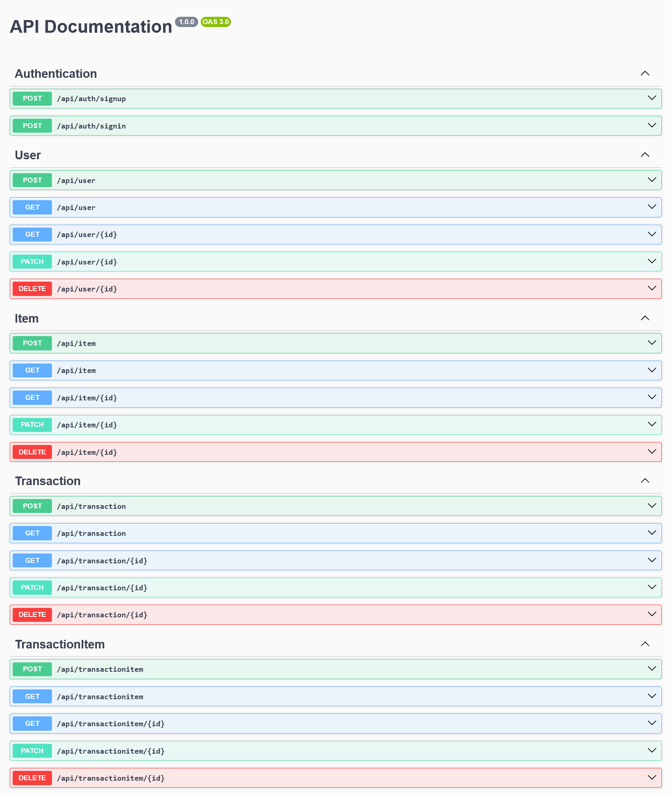

<br />
<div>
  

  <h3>Item Store API</h3>

  <p>
    API sederhana untuk mencatat transaksi sederhana
    <br /><br />
    <a href="https://documenter.getpostman.com/view/29780531/2sB2qf9yVW"><strong>Explore the docs</strong></a>
  </p>
</div>

## Tentang Proyek

Itemstore API adalah API sederhana yang dapat meng-handle skenario transaksi sederhana.

## Arsitektur Proyek: Domain Driven Structure

### Struktur Direktori

 ```plaintext
  ├───config
  ├───prisma
  └───modules
      ├───auth
      │   ├───controller
      │   ├───dto
      │   ├───guard
      │   ├───service
      │   └───strategy
      ├───item
      │   ├───controller
      │   ├───dto
      │   └───service
      ├───transaction
      │   ├───controller
      │   ├───dto
      │   └───service
      └───user
          ├───controller
          ├───dto
          └───service
 ```

---

### Keunggulan Domain Driven Structure
1. Modularitas Tinggi

  - Setiap domain (misalnya auth, transaction, user) berdiri sendiri dengan dependensi minimal terhadap domain lain.

  - Dapat dipisah dengan mudah jika akan dijadikan microservices.

2. Scalability

  - Struktur ini tetap rapi dan terorganisir saat jumlah fitur bertambah.

  - Penambahan domain baru dapat dilakukan tanpa mengganggu domain lain.

3. Separation of Concerns

  - Logika bisnis (service), logika presentasi (controller), dan kontrak data (dto) dipisah secara jelas.

  - Mempermudah testing, debugging, dan pemeliharaan.

## Prerequisites

Ensure you have the following installed:

1. **Node.js** (v18 or higher) - [Download Node.js](https://nodejs.org/)
2. **npm** (bundled with Node.js) or **Yarn** (latest version)
3. **PostgreSQL** (v13 or higher) - [Download PostgreSQL](https://www.postgresql.org/)
4. **Git** - [Download Git](https://git-scm.com/)


## 🚦 Instalasi

### 1. Clone the Repository

```bash
git clone https://github.com/rickytedjo/itemstore-api
cd ngejoblist
```
--- 
### 2. Install Dependencies

Run the following command to install required packages:

```bash
npm install
```

or if using Yarn:

```bash
yarn install
```
---
### 3. Environment Setup

Create a `.env` file in the root directory. Use the `.env.example` file as a template:

```bash
cp .env.example .env
```

Fill in the necessary environment variables in the `.env` file. For example:

```env
# Konfigurasi Database
PORT="3000" //Based on available ports in your device

DATABASE_URL="postgresql://[username]:[password]@[host]:[port]/[name]?schema=public"

JWT_SECRET="any_random_special_word"
```

---

### 4. Database Setup

#### a. Create the Database (Opsional)
Ensure PostgreSQL is running and create a new database for the application:

```sql
CREATE DATABASE your_database_name;
```

P.S: Prisma could create a new database automatically for you if it doesn't exist.

#### b. Run Database Migrations

Run the Prisma migrations to set up the database schema:

```bash
npx prisma migrate dev
```

---

### 5. Start the Application

Run the application in development mode:

```bash
npm run start:dev
```
---

### 6. Running Tests

To run end-to-end (e2e) tests:

```bash
npm run test:e2e
```

---

## API Documentation

The application comes with integrated Swagger documentation. After starting the server, visit:

```
http://localhost:<PORT>/api/docs
```

Here, `<PORT>` is the port specified in the `.env` file (default: 3000).

---

## Kontak
Email: <rickyputra.tedjo@gmail.com>

Link Proyek: <https://github.com/rickytedjo/itemstore-api>